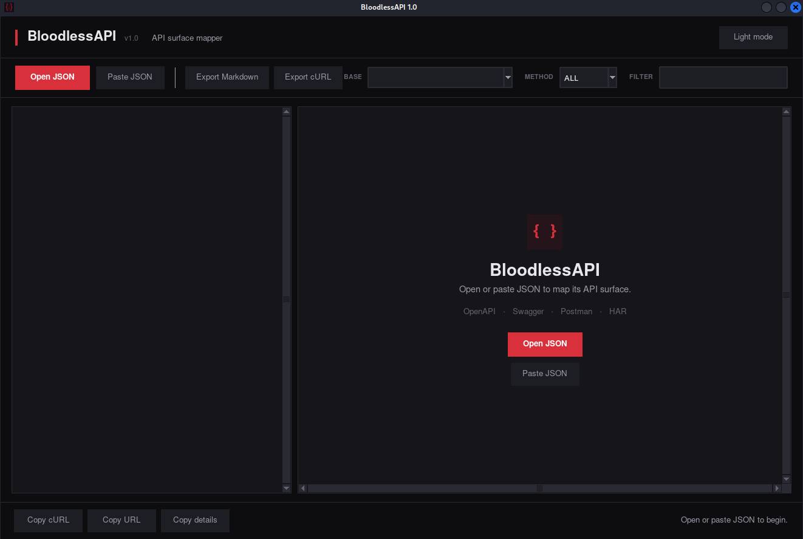
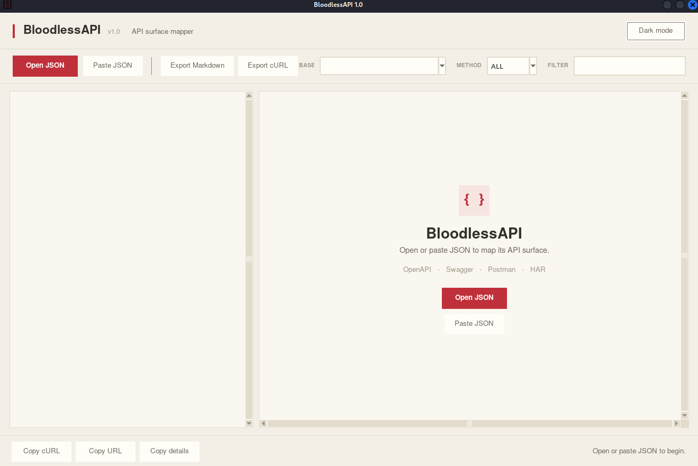
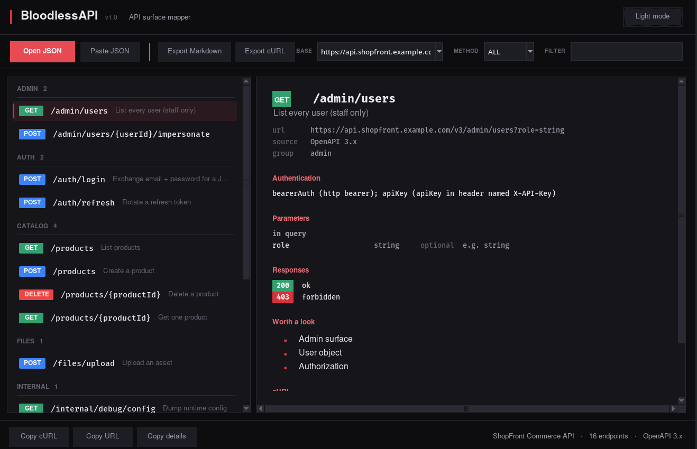
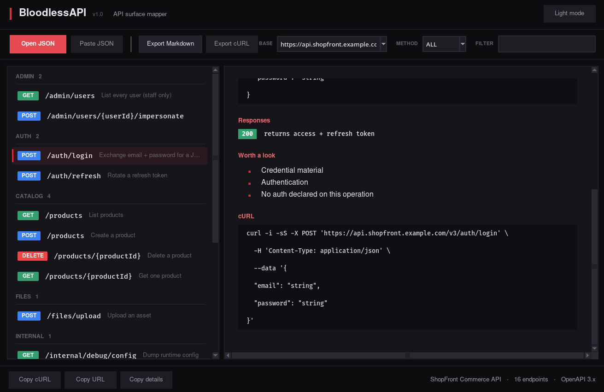
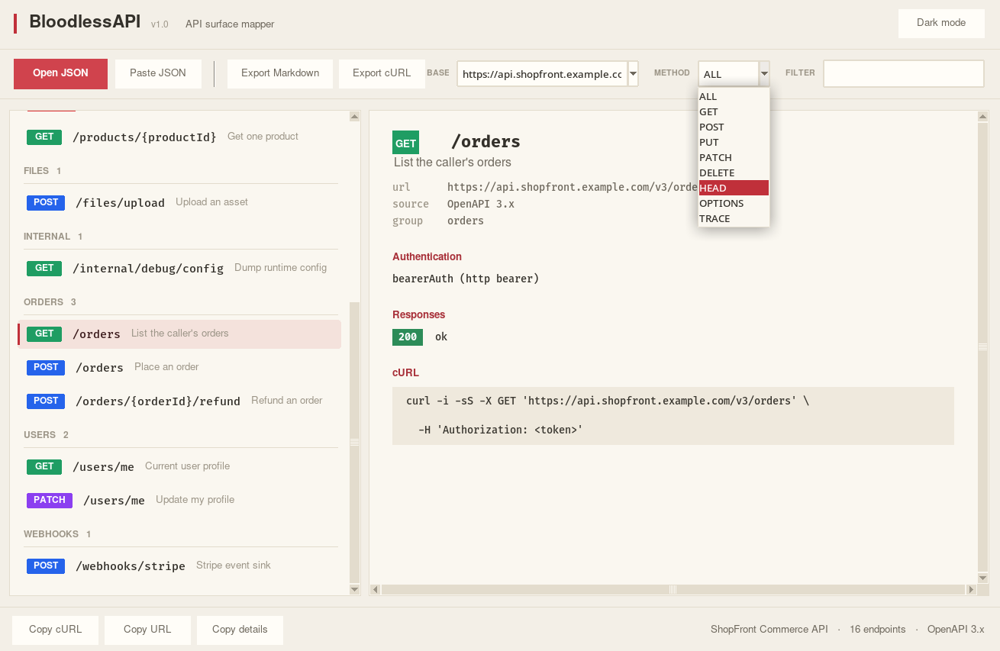
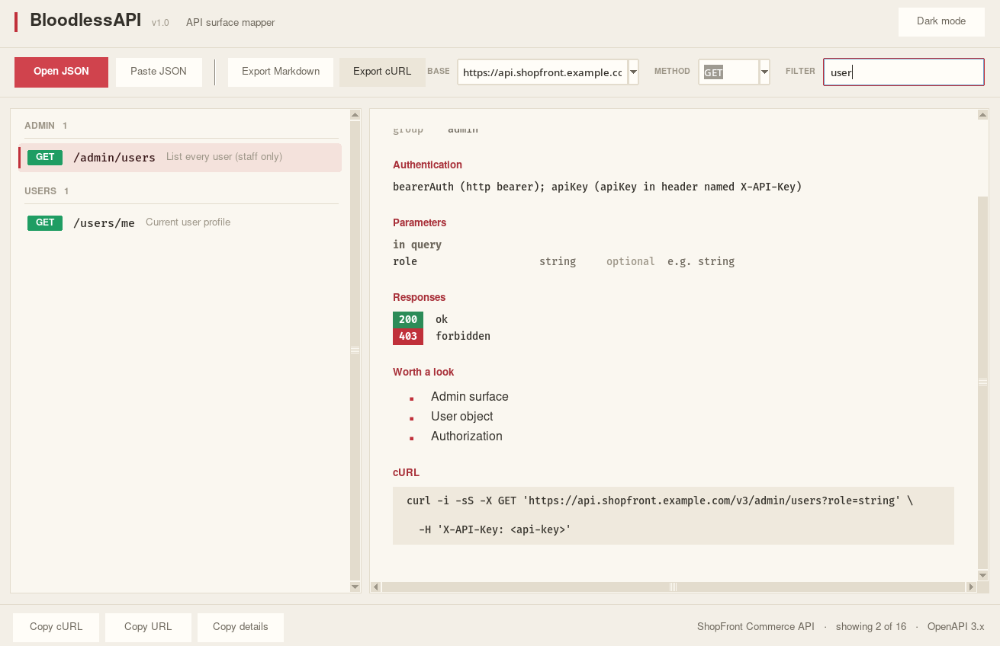

### Disclaimer

This tool is provided for **authorized security research and educational purposes only**.

- Only use this tool on systems you own or have explicit written permission to test
- The authors assume no liability for misuse or damage caused by this tool
- Users are responsible for complying with all applicable local, state, and federal laws
- This tool comes with no warranty - use at your own risk

By using this software, you agree that you will not use it for any illegal or unauthorized activities.


### Prerequisites

- **Python 3.8+** 
- `tkinter`

### Installation + Usage:
```
git clone https://github.com/YOUR_USERNAME/BloodlessAPI.git
cd BloodlessAPI

# Run the app:
python bloodlessapi.py
```


### About 

***An offline API surface mapper*** - all you need is to paste the copied `.json` or upload a `.json` file, and the app makes it a clean endpoint map/tree. 

### Features:

- Offline - no need to upload potentially sensitive data to any website (or similar) to map the API
- Clean endpoint tree generation
- Suggests what's worth a look
- Detailed view
- One click export to Markdown (`.md`) or cURL, or just copy the URL
- Export all cURL
- Paste the copied `.json` directly
- Clean design


The app has 2 themes:
- Dark theme:

* Light theme:



### Showcase:





### LICENSE 
[MIT](LICENSE)
